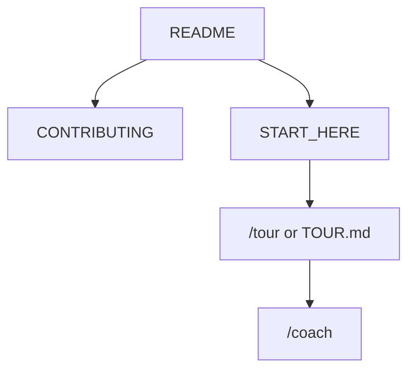

<!-- GENERATED by scripts/generate-project-readme.py — edit branding/product.json -->

  

<h1 align="center">Hermes Launcher</h1>

<strong>Your notifications, news, and podcasts — as home.</strong>

  
  
  
  
  
  
  
  
  
  
  

  
  
  

## Pitch

Hermes Launcher is a FOSS Android home-screen replacement whose primary page is a persistent notification inbox mixed with news feeds and podcasts. Cards dismiss only via an explicit X; horizontal swipes page to extra widget screens. Everything stays local, private, and F-Droid ready.

## Demo

  

> Add screenshots or a short demo GIF under `docs/images/` and link them here when available.

## Features

- Inbox-as-home: live and historical notifications without swipe-to-dismiss
- Local Room vault for chat text and images after the source app deletes them
- Extra swipeable pages that host traditional Android App Widgets
- Large customizable dock, app drawer, search, and icon-pack support
- FOSS-only Gradle/Kotlin/Compose stack with reproducible F-Droid builds

## Quick start

1. Clone the repo and open it in Cursor. Type `/tour` or read `docs/START_HERE.md`.
2. Install JDK 17+ and the Android SDK (API 34+ AOSP image).
3. From `examples/android`, run `./gradlew assembleDebug` with `SOURCE_DATE_EPOCH=1700000000`.

## For humans

Start with this README, then [`CONTRIBUTING.md`](../../CONTRIBUTING.md) and [`docs/BEST_PRACTICES.md`](../../docs/BEST_PRACTICES.md). The first-month playbook is [`docs/FIRST_30_DAYS.md`](../../docs/FIRST_30_DAYS.md).

## For agents

Read [`docs/START_HERE.md`](../../docs/START_HERE.md) and [`AGENTS.md`](../../AGENTS.md). In Cursor type `/tour` or `/bootstrap`. Any other IDE: ask the agent to read [`docs/help/TOUR.md`](../../docs/help/TOUR.md). `/coach` is the next recommended action.

## Install

Sideload the debug APK or install a GitHub Release. F-Droid metadata lives under `examples/android/metadata/` and `examples/android/fastlane/`.

## Usage

Set Hermes as the default Home app. Grant notification access when onboarding asks. Swipe horizontally for widget pages; tap X to dismiss a card. Open Settings from the gear for theme, privacy, and vault controls.

## Configuration

Copy [`.env.example`](../../.env.example) to `.env` for local secrets (never commit `.env`). Stack-specific config lives in the active `examples/` or app root after prune.

## Contributing

See [`../../CONTRIBUTING.md`](../../CONTRIBUTING.md). Prefer small PRs; follow Conventional Commits and the BUILD_PLAN labels (`AGENT` / `HUMAN` / `ADB` / `AUTO`). Status markers: 🔲 open · ✅ done · ❌ blocked.

## Security

See [`../../SECURITY.md`](../../SECURITY.md). Enable Dependabot alerts and follow [`docs/SECURITY_TRIAGE.md`](../../docs/SECURITY_TRIAGE.md) for weekly CVE triage.

## License

[MIT License](../../LICENSE) — see the license file for terms.

## Acknowledgments

Scaffolded with [agent-project-bootstrap](https://github.com/edwardlthompson/agent-project-bootstrap). Brand assets: [`../BRANDING.md`](../BRANDING.md). Design system: [`../../docs/DESIGN_GUIDE.md`](../../docs/DESIGN_GUIDE.md).
