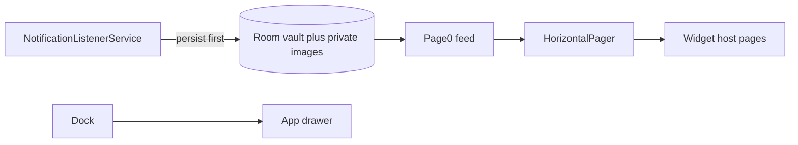

# Product Specification

> Spec-driven development. Feature slices use `docs/features/{name}.md`.
> Status markers: open / done / blocked use BUILD_PLAN emoji markers.

## Overview

**Product:** Hermes Launcher
**Tagline:** Your notifications, news, and podcasts — as home.
**Purpose:** FOSS Android home-screen replacement whose primary page is a persistent notification inbox mixed with news feeds and podcasts.
**Users:** Privacy-conscious Android users, former Posidon users, people who treat a notification feed as home, FOSS/F-Droid users, OEM-skin users who struggle with notification access.

## Functional Requirements & User Stories

| ID | Story | Acceptance |
|----|-------|------------|
| FR-1 | As a user I set Hermes as Home so the inbox is my first screen | Activity declares `MAIN` + `HOME` + `DEFAULT`; system chooser lists Hermes |
| FR-2 | As a user I scroll a mixed feed of notifications, news, and podcasts | Page 0 is a vertical `LazyColumn`; cards never swipe-dismiss |
| FR-3 | As a user I swipe horizontally to extra widget pages | `HorizontalPager` changes page; feed cards do not consume horizontal swipe |
| FR-4 | As a user I dismiss a card only by tapping X | X has a 48dp target and content description; one item archived |
| FR-5 | As a user I keep chat text and images after the source app deletes them | Vault persists at post time when per-app store policy allows |
| FR-6 | As a user I search and filter live inbox plus history | Filters: All / Messages / News / System / Podcasts / Unread / Pinned / per-app |
| FR-7 | As a user I recover when OEM kills notification access | Banner + one-tap re-grant; no silent data collection after revoke |
| FR-8 | As a user I play a podcast episode from a feed card | Media3 mini-player; simple RSS enclosures only |
| FR-9 | As a user I customize dock, theme, and icon pack | DataStore prefs survive reboot; strings from `strings.xml` |
| FR-10 | As a user I ignore an app so its notifications leave the inbox | Blacklist writes `storeContent=false`; live and unread filters hide that package until X |
| FR-11 | As a user I keep inbox cards the same height | Truncate toggle plus character chips (80–240) apply `maxLines` and an ellipsis |
| FR-12 | As a user I hide tiny or avatar notification photos | Toggle skips `largeIcon` and images below 240px |
| FR-13 | As a user I find recently opened apps first while typing | All Apps and installed-app pickers rank by last launch, then label |
| FR-14 | As a user I unsubscribe from a news or podcast feed | Settings → Feeds → Subscriptions Unsubscribe removes the sub and unstarred articles |
| FR-15 | As a user I turn notify or prefetch on for every feed | Notify all / Prefetch all write every `FeedSub` in one store replace |
| FR-16 | As a user I open a short settings hub instead of twelve panes | Hub is Home, Inbox, Feeds, System; long lists sit in expanders |

## Non-Functional Constraints

- MIT license; no proprietary SDKs (no Play Services, Firebase, or closed telemetry)
- File budgets: 300 lines static/UI+i18n, 150 lines pure logic
- `SOURCE_DATE_EPOCH` reproducible APKs; pinned Gradle wrapper
- User-visible copy only in `res/values/strings.xml`
- Local-only vault; no cloud sync
- Do not store notification content from apps the user has not granted (or later revoked)

## Non-goals

- Not a 1:1 clone of Posidon or Notifications Widget
- No swipe-to-dismiss or swipe-to-archive on cards
- Not a full email client or heavy podcast app
- No cloud sync of the vault

## Success metrics

- NotificationListener survives OEM battery optimizations with onboarding that names the OEM
- Horizontal swipe never dismisses a card
- Vault retains granted chat text + images after source-app deletion
- F-Droid-ready reproducible builds
- Compose `LazyColumn` only (no RecyclerView crash paths)

## Architecture & Data Flow

## Test-first rule

Every feature in `docs/plan.md` / BUILD_PLAN must list tests, or state why automation is not feasible and name the fallback command.
